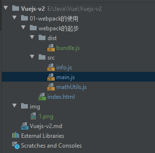
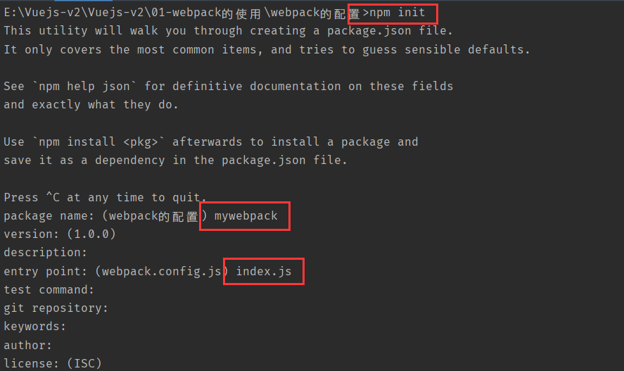
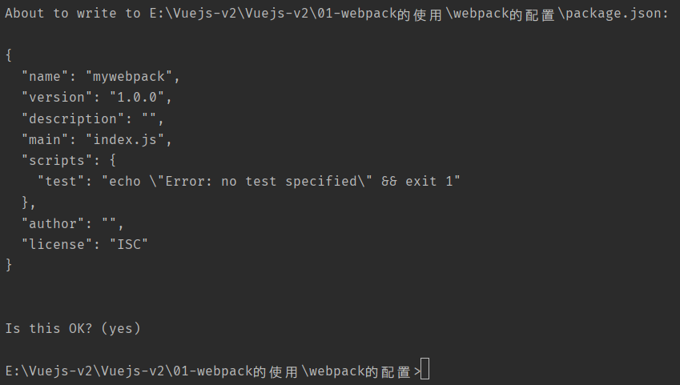

# Vuejs-Webpack

## webpack的使用

### webpack的安装

要安装webpack必须先要安装node, 可以去[node官网](https://nodejs.org/zh-cn/download/)进行下载.  

在cmd中输入node -v可以查看到版本号.

然后在npm命令可以使用后, 运行`npm install webpack@3.6.0 -g`安装webpack

`-g`表示全局运用.  

### webpack的基本使用



在`src`进行模块化开发然后使用以下命令对`src`中的js文件进行打包使用

```
E:\Java\Vue\Vuejs-v2\01-webpack的使用\webpack的起步>webpack ./src/main.js ./dist/bundle.js
```

```html
<!DOCTYPE html>
<html lang="en">
<head>
  <meta charset="UTF-8">
  <title>Title</title>
</head>
<body>
<script src="./dist/bundle.js"></script>
</body>
</html>
```

在`src`中可以使用多种模块化的开发规范, 在`webpack`的帮助下会将其打包

打包方式, 在命令行中将`main.js`打包到`dist/bundle.js`中, 这里不单单只是打包了`main.js`中的代码, 还有与之相关联的其他`.js`文件的代码如:

**info.js**

```javascript
export const name = 'zhou';
export const age = 24;
export const height = 1.8;
```

**mathUtils.js**

```javascript
function add(num1, num2) {
  return num1 + num2
}
function mul(num1, num2) {
  return num1 * num2
}
// 使用模块化开发
module.exports={
  add, mul
}
```

**main.js**

```javascript
// 使用commonjs的模块化规范
const {add, mul} = require('./mathUtils.js')

console.log(add(20, 30));
console.log(mul(20, 30));

// 使用ES6的模块化的规范
import {name, age, height} from "./info";

console.log(name + '--' + age + '--' + height);
```

在webpack会将上面三个`.js`文件的代码都打包到`bundle.js`中去.

### webpack的配置

在基本使用中每次打包都需要输入`webpack ./src/main.js ./dist/bundle.js`这样一大串字符, 有一种方法可以将这种打包的方法简化的方法.

在`src`中创建`webpack.config.js`文件, 

```javascript
const path = require('path')
module.exports = {
  entry: './src/main.js',
  output: {
    // __dirname可以获取到当前路径, 然后拼接dist
    path: path.resolve(__dirname, 'dist'),
    filename: 'bundle.js'
  }
}
```

这段代码就为了配置需要打包的`.js`文件和打包的目的地.  

 `const path = require('path')`需要依赖node的一些包, 需要建立`package.json`进行管理.




生成`package.json`文件, 运行`npm install`之后会下载一些相关的依赖. 这样node就可以帮忙管理一些包了

在之后的开发中使用`webpack`进行打包的方法也是比较少的, 而是会换成另一种方法进行打包, 这种方法需要在生成的`package.json`文件中进行配置.

```json
{
  "name": "mywebpack",
  "version": "1.0.0",
  "description": "",
  "main": "index.js",
  "scripts": {
    "test": "echo \"Error: no test specified\" && exit 1",
    "bundle": "webpack"
  },
  "author": "Altria",
  "license": "ISC"
}
```

在`"scripts"`中添加`"bundle": "webpack"`然后在控制面板上面输入`npm run bundle`就可以进行打包

#### webpack的局部配置

在开发中, 不是每个项目需要的版本都能和自己电脑上的webpack版本对应的, 这个时候为了避免出问题需要在局部进行webpack的安装和配置.

```
E:\Vuejs-v2\Vuejs-v2\01-webpack的使用\webpack的配置>npm install webpack@3.6.0 --save-dev
```

在对应项目下面进行安装对应版本, 后缀也不是`-g`而是`--save-dev`.

在安装好之后, `package.json`中会多出一行配置

```json
{
  "name": "mywebpack",
  "version": "1.0.0",
  "description": "",
  "main": "index.js",
  "scripts": {
    "test": "echo \"Error: no test specified\" && exit 1",
    "bundle": "webpack"
  },
  "author": "Altria",
  "license": "ISC",
  "devDependencies": {
    "webpack": "^3.6.0"
  }
}
```

`"devDependencies"`表示开发时依赖.

### [loader](https://www.webpackjs.com/)

#### `webpack`是用来做什么的?

在上面的案例中, webpack主要是用来处理js代码的, 并且webpack会自动处理js之间相关的依赖.

但是在开发中需要处理的不仅只有基本的js代码, 还有css, 图片, 也包括一些高级的将ES6转成ES5代码, 将TypeScript转成ES5代码, 将scss, less转成css, 将.jsx .vue文件转成.js文件等.

对于webpack本身的能力来说, 这些转化是不支持的. 但是给webpack扩展对应的loader就可以了.

#### loader的使用过程

1. 在main.js中依赖css文件, 没有其他地方使用所以不需要再前面添加变量

   ```javascript
   require('./css/normal.css')
   ```

2. 通过npm安装需要使用的loader.

```
npm install --save-dev css-loader
npm install style-loader --save-dev

```

3. 在webpack.config.js中的modules关键字下进行配置
```json
module: {
    rules: [
      {
        test: /\.css$/,
        use: [ 'style-loader','css-loader' ]
      }
    ]
  }
```

`css-loader`只负责将css文件进行加载, 不负责解析, 所以在安装了`css-loader`之后还需要安装`style-loader`

`style-loader`负责将样式添加到DOM中

使用多个loader时, 是从右向左读, 如果在`use: []`中将顺序反过来会在打包时报错