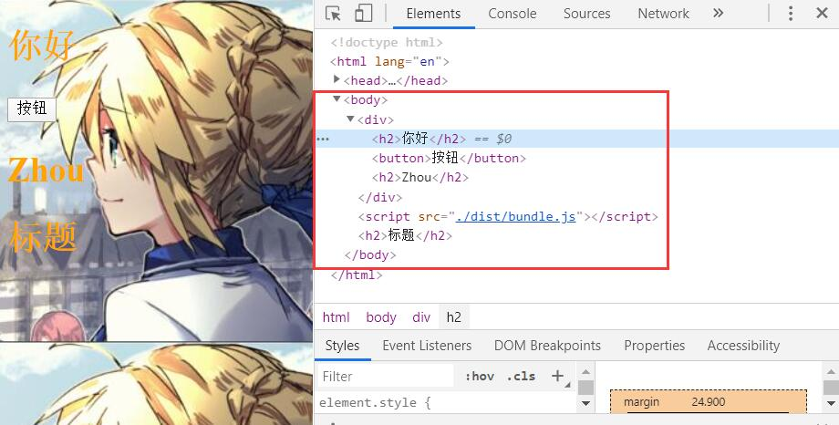
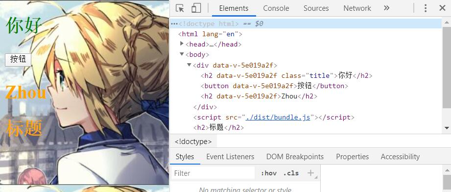
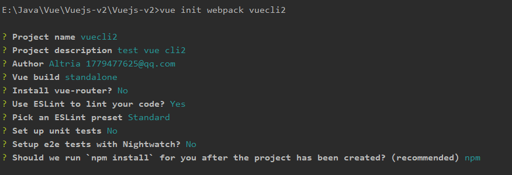

# Vuejs-Webpack

## webpack的使用

### webpack的安装

要安装webpack必须先要安装node, 可以去[node官网](https://nodejs.org/zh-cn/download/)进行下载.  

在cmd中输入node -v可以查看到版本号.

然后在npm命令可以使用后, 运行`npm install webpack@3.6.0 -g`安装webpack

`-g`表示全局运用.  

### webpack的基本使用


在`src`进行模块化开发然后使用以下命令对`src`中的js文件进行打包使用

```
E:\Java\Vue\Vuejs-v2\01-webpack的使用\webpack的起步>webpack ./src/main.js ./dist/bundle.js
```

```html
<!DOCTYPE html>
<html lang="en">
<head>
  <meta charset="UTF-8">
  <title>Title</title>
</head>
<body>
<script src="./dist/bundle.js"></script>
</body>
</html>
```

在`src`中可以使用多种模块化的开发规范, 在`webpack`的帮助下会将其打包

打包方式, 在命令行中将`main.js`打包到`dist/bundle.js`中, 这里不单单只是打包了`main.js`中的代码, 还有与之相关联的其他`.js`文件的代码如:

**info.js**

```javascript
export const name = 'zhou';
export const age = 24;
export const height = 1.8;
```

**mathUtils.js**

```javascript
function add(num1, num2) {
  return num1 + num2
}
function mul(num1, num2) {
  return num1 * num2
}
// 使用模块化开发
module.exports={
  add, mul
}
```

**main.js**

```javascript
// 使用commonjs的模块化规范
const {add, mul} = require('./mathUtils.js')

console.log(add(20, 30));
console.log(mul(20, 30));

// 使用ES6的模块化的规范
import {name, age, height} from "./info";

console.log(name + '--' + age + '--' + height);
```

在webpack会将上面三个`.js`文件的代码都打包到`bundle.js`中去.

### webpack的配置

在基本使用中每次打包都需要输入`webpack ./src/main.js ./dist/bundle.js`这样一大串字符, 有一种方法可以将这种打包的方法简化的方法.

在`src`中创建`webpack.config.js`文件, 

```javascript
const path = require('path')
module.exports = {
  entry: './src/main.js',
  output: {
    // __dirname可以获取到当前路径, 然后拼接dist
    path: path.resolve(__dirname, 'dist'),
    filename: 'bundle.js'
  }
}
```

这段代码就为了配置需要打包的`.js`文件和打包的目的地.  

 `const path = require('path')`需要依赖node的一些包, 需要建立`package.json`进行管理.


生成`package.json`文件, 运行`npm install`之后会下载一些相关的依赖. 这样node就可以帮忙管理一些包了

在之后的开发中使用`webpack`进行打包的方法也是比较少的, 而是会换成另一种方法进行打包, 这种方法需要在生成的`package.json`文件中进行配置.

```json
{
  "name": "mywebpack",
  "version": "1.0.0",
  "description": "",
  "main": "index.js",
  "scripts": {
    "test": "echo \"Error: no test specified\" && exit 1",
    "bundle": "webpack"
  },
  "author": "Altria",
  "license": "ISC"
}
```

在`"scripts"`中添加`"bundle": "webpack"`然后在控制面板上面输入`npm run bundle`就可以进行打包

#### webpack的局部配置

在开发中, 不是每个项目需要的版本都能和自己电脑上的webpack版本对应的, 这个时候为了避免出问题需要在局部进行webpack的安装和配置.

```
E:\Vuejs-v2\Vuejs-v2\01-webpack的使用\webpack的配置>npm install webpack@3.6.0 --save-dev
```

在对应项目下面进行安装对应版本, 后缀也不是`-g`而是`--save-dev`.

在安装好之后, `package.json`中会多出一行配置

```json
{
  "name": "mywebpack",
  "version": "1.0.0",
  "description": "",
  "main": "index.js",
  "scripts": {
    "test": "echo \"Error: no test specified\" && exit 1",
    "bundle": "webpack"
  },
  "author": "Altria",
  "license": "ISC",
  "devDependencies": {
    "webpack": "^3.6.0"
  }
}
```

`"devDependencies"`表示开发时依赖.

### [loader预处理](https://www.webpackjs.com/)

#### `webpack`是用来做什么的?

在上面的案例中, webpack主要是用来处理js代码的, 并且webpack会自动处理js之间相关的依赖.

但是在开发中需要处理的不仅只有基本的js代码, 还有css, 图片, 也包括一些高级的将ES6转成ES5代码, 将TypeScript转成ES5代码, 将scss, less转成css, 将.jsx .vue文件转成.js文件等.

对于webpack本身的能力来说, 这些转化是不支持的. 但是给webpack扩展对应的loader就可以了.

#### loader预处理css

1. 在main.js中依赖css文件, 没有其他地方使用所以不需要再前面添加变量

   ```javascript
   require('./css/normal.css')
   ```

2. 通过npm安装需要使用的loader. 打包不同的依赖需要不同的loader

```
npm install --save-dev css-loader
npm install style-loader --save-dev
```

3. 在`webpack.config.js`中的modules关键字下进行配置
```json
module: {
    rules: [
      {
        test: /\.css$/,
        use: [ 'style-loader','css-loader' ]
      }
    ]
  }
```

`css-loader`只负责将css文件进行加载, 不负责解析, 所以在安装了`css-loader`之后还需要安装`style-loader`

`style-loader`负责将样式添加到DOM中

使用多个loader时, 是从右向左读, 如果在`use: []`中将顺序反过来会在打包时报错

#### loader预处理less

在项目中安装`less-loader`

```
npm install --save-dev less-loader less
```

在`webpack.config.js`中添加配置

```javascript
// webpack.config.js
module.exports = {
    ...
    module: {
        rules: [{
            test: /\.less$/,
            use: [{
                loader: "style-loader" // creates style nodes from JS strings
            }, {
                loader: "css-loader" // translates CSS into CommonJS
            }, {
                loader: "less-loader" // compiles Less to CSS
            }]
        }]
    }
};
```

#### loader预处理url

加载文件需要两个loader, url-loader和file-loader

```
npm install --save-dev url-loader
npm install --save-dev file-loader
```

`webpack.config.js`添加配置

```javascript
module.exports = {
  output: {
    publicPath: 'dist/'
  },
  module: {
    rules: [
      {
        test: /\.(png|jpg|gif)$/,
        use: [
          {
            loader: 'url-loader',
            options: {
              limit: 8192,
              name: 'img/[name][hash].[ext]'
            }
          }
        ]
      }
    ]
  }
}
```

在`webpack.config.js`中的`options: { limit: 8192 }`的属性, limit表示图片大小(8192b共8k)

如果加载的图片大于8k则需要使用`file-loader`, 如果小于则将该图片转成beas64格式的文件进行展示. 

如果图片大于指定大小, 这会将这个图片打包进指定的打包文件, 到时候程序是无法正常找到打包后的图片的, 需要在`module.exports={ output: {  } }`中添加`publicPath: 'dist/'`属性, 以后url相关的文件系统都会在这个指定的文件夹下查找.

在把文件打包之后, 图片也会跟着被打包, 但是图片的名字会被重新用hash32码命名. 可以使用`name: '[name][hash:8].[ext]'`对命名进行规范操作.

#### loader预处理ES6

```
npm install --save-dev babel-loader@7 babel-core babel-preset-es2015
```

这里加载加载的是与本项目更贴近的一个配置, 新的版本需要去官网查找

```javascript
module: {
  rules: [
    {
      test: /\.js$/,
      exclude: /(node_modules|bower_components)/,
      use: {
        loader: 'babel-loader',
        options: {
          presets: ['es2015']
        }
      }
    }
  ]
}
```

`exclude: /(node_modules|bower_components)/,`exclude表示排除里面指定的文件夹

运行之后打包后的`.js`文件将没有ES6的语法规范, 会全部转化成ES5的

### webpack配置vue

安装vue

```
npm install vue --save
```

引入vue

```javascript
// 使用vue进行开发
import Vue from 'vue'
const app = new Vue({
  el: '#app',
  data: {
    message: '你好'
  }
})
```

```html
<div id="app">
  <h2>{{message}}</h2>
</div>
```

在配置完这些之后还是不能直接使用会报错

```
bundle.js:1310 [Vue warn]: You are using the runtime-only build of Vue where the template compiler is not available. Either pre-compile the templates into render functions, or use the compiler-included build.
```

这个报错的解决方法是在`webpack.config.js`中添加一个配置

```json
module.exports = {
  resolve: {
    // 别名
    alias: {
      'vue$': 'vue/dist/vue.esm.js'
    }
  }
}
```

在指定了这个文件之后然后重新打包, 就可以正常使用了

#### el和template

在`new Vue()`中`el`用于指定对应的div标签, 然后vue会将template中的代码覆盖上去

```html
<div id="app">
  <h2>测试是否会覆盖</h2>
</div>
```



#### 将vue组件分离到`.js文件`中

App.js

```javascript
export default {
  template: `
  <div>
    <h2>{{msg}}</h2>
    <button @click="btnclick">按钮</button>
    <h2>{{name}}</h2>
  </div>
  `,
  data() {
    return{
      msg: '你好',
      name: 'Zhou'
    }
  },
  methods: {
    btnclick() {
      console.log('btnclick');
    }
  }
}
```

main.js进行依赖

```javascript
// 使用vue进行开发
import Vue from 'vue'
import App from './vue/App'
new Vue({
  el: '#app',
  template: '<App/>',
  components: {
    App
  }
})
```

#### 将vue组件分离到`.vue文件`中

App.vue

```vue
<template>
  <div>
    <h2 class="title">{{msg}}</h2>
    <button @click="btnclick">按钮</button>
    <h2>{{name}}</h2>
  </div>
</template>
<script>
  export default {
    name: "App",
    data() {
      return{
        msg: '你好',
        name: 'Zhou'
      }
    },
    methods: {
      btnclick() {
        console.log('btnclick');
      }
    }
  }
</script>
<style scoped>
  .title{
    color: green;
  }
</style>
```

main.js进行依赖

```javascript
// 使用vue进行开发
import Vue from 'vue'
import App from './vue/App'

new Vue({
  el: '#app',
  template: '<App/>',
  components: {
    App
  }
})
```

但是光这样vue还是无法运行. 需要`vue-loader`和`vue-template-compiler`

```
npm install vue-loader vue-template-compiler -save-dev
```

vue-loader: 用于加载vue文件

vue-template-compiler: 将vue进行编译

安装之后在webpack.config.js中进行配置

```javascript
module: {
  rules: [
    {
      test: /\.vue$/,
      use: ['vue-loader']
    }
  ]
}
```

但是这样还是会报错, 原因是版本不兼容造成的需要将版本降低, 

在package.json中把`"vue-loader": "^15.8.3"`改成`"vue-loader": "^13.0.0"`



##### 插入子组件

Cpn.vue

```vue
<template>
  <div>
    <h2>子组件标题</h2>
    <p>子组件内容</p>
    <p>{{name}}</p>
  </div>
</template>
<script>
  export default {
    name: "Cpn",
    data() {
      return {
        name: 'Altria'
      }
    }
  }
</script>
<style scoped>
</style>
```

App.vue

```vue
<template>
  <div>
    <h2 class="title">{{msg}}</h2>
    <button @click="btnclick">按钮</button>
    <h2>{{name}}</h2>
    <Cpn></Cpn>
  </div>
</template>
<script>
  // 引入子组件
  import Cpn from './Cpn.vue'
  export default {
    name: "App",
    data() {
      return{
        msg: '你好',
        name: 'Zhou'
      }
    },
    methods: {
      btnclick() {
        console.log('btnclick');
      }
    },
    components: {
      Cpn
    }
  }
</script>
```

可以正常使用

### plugin(插件)

#### 打包html的plugin

目前, 我们的index.html是存放在项目的根目录下的, 而我们真实发布项目时, 只会发布dist文件夹中的内容 , 但是dist文件夹中没有index.html, 那么打包js等文件就没有意义了.

所以需要HtmlWebpackPlugin插件来为我们做这些事.

##### HtmlWebpackPlugin

自动生成一个index.html文件(可以指定生成模板)

将打包的js文件自动通过script标签插入到body中

**安装**

```
npm install html-webpack-plugin --save-dev
```

对webpack.config.js进行配置

```javascript
  plugins: [
    new HtmlWebpackPlugin({
      template: 'index.html'
    })
  ]
```

如果不填写`template: 'index.html'`则会生成默认的index.html

#### js的压缩

为了与当前项目版本相对应这里选用了1.1.1版本

```
npm install uglifyjs-webpack-plugin@1.1.1 -save-dev
```

在webpack.config.js中进行配置

```javascript
  const UglifyjsWebpackPlugin = require('uglifyjs-webpack-plugin')
  plugins: [
    new UglifyjsWebpackPlugin()
  ]
```

因为这里进行了压缩, 注释什么的也没有了, 所以版权声明什么的可以去掉了

#### webpack-dev-server热更新

webpack提供了一个可选的本地开发服务器, 可以实现我们想要的让浏览器自动刷新显示我们修改过的结果

**安装**

```
npm install --save-dev webpack-dev-server@2.9.1
```

**修改webpack.config.js文件**

```javascript
module.exports = {
  dveServer: {
    contentBase: './dist',
    inline: true
  }
}
```

**修改package.json文件**

在scripts中添加

```json
  "scripts": {
    "dev": "webpack-dev-server --open"
  },
```

在局部中运行并打开

# Vue CLI的使用

## Vue CLI安装

安装vue脚手架

```
npm install -g @vue/cli
```

上面安装的是当前的最新版本, 如果想要按照Vue CLI2的方式初始化项目是不可能的

拉去2.x模板

```
npm install -g @vue/cli-init
```

Vue CLI2初始化项目

```
vue init webpack my-project
```

Vue CLI3初始化项目

```
vue create my-project
```

### 开始安装

```
vue init webpack vuecli2
```



